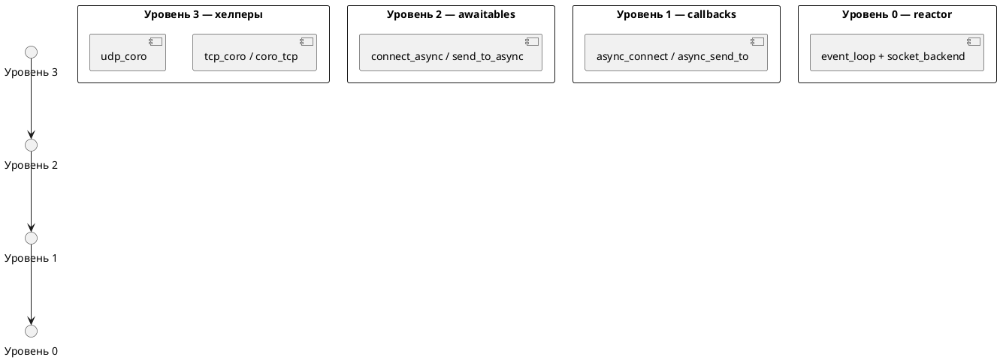

# Слои API netlib

Библиотека предлагает уровни абстракции для TCP/UDP. Выбор зависит от стиля приложения и требований к отмене/таймаутам.

Оглавление документации: [README.md](README.md). Диаграмма зависимостей: [diagrams/layers.puml](diagrams/layers.puml).

## 1. Callback API (низкий уровень)

Классы `tcp_socket`, `tcp_acceptor`, `udp_socket`:

**TCP:**

- `async_connect`, `async_read_some`, `async_write_all`, `async_accept`
- Колбэки `std::move_only_function`, явный `event_loop`
- Отмена: `cancel_io` / `cancel_accept`

**UDP (только транспорт, без DNS-модуля):**

- `udp_socket::bind`, `async_send_to`, `async_recv_from`
- `cancel_io` — как у TCP
- Разрешение `endpoint.host` при sendto — через тот же `getaddrinfo`, что и TCP (не отдельный DNS API)

**Когда использовать:** legacy-код, тонкий контроль без coroutines, обёртки вроде `simple::tcp_connection`.

**Ограничения:** цепочки колбэков, ручной lifetime (`io_handle()` при move сокета в лямбду).

## 2. Coroutine awaitables (рекомендуется)

Заголовки `net/awaitables.hpp`, `net/coro.hpp`:

| Операция | Awaitable |
|----------|-----------|
| connect | `connect_async` |
| write | `write_all_async` |
| read | `read_some_async`, `read_exact_async` |
| accept | `accept_async` |
| UDP send | `send_to_async` |
| UDP recv | `recv_from_async` |

Опционально `cancellation_token*` — при `cancel()` снимается pending I/O.

Таймауты: `net/timeout.hpp` — `connect_with_timeout`, `read_*_with_timeout`, `accept_with_timeout`.  
По таймауту бросается `execution::timeout_error`, затем в `catch` вызывается `cancellation_source::cancel()` (чтобы `when_any` не подменял тип ошибки).

## 3. Высокоуровневые coro-хелперы

`net/coro_tcp.hpp`, `net/tcp_coro.hpp`:

- `read_string_async`, `tcp_echo_peer`, `tcp_serve_echo_once`
- `tcp_echo_server_loop`, `tcp_connect` (+ overload с таймаутом)
- `read_string_with_timeout`
- `udp_send_string`, `udp_recv_string`, `udp_echo_once`, `udp_echo_loop`

Execution: `task`, `when_all`, `when_any`, `with_timeout`, `delay_async` — см. [GETTING_STARTED.md](GETTING_STARTED.md).

## Отмена и гонки

| Механизм | Назначение |
|----------|------------|
| `cancellation_token` | Явная отмена connect/read/write/accept |
| `when_any` + `on_loser_*` | Кооперативный выход проигравшей coroutine |
| `with_timeout` + `on_work_lost` | То же для primary при победе таймаута |
| `*_with_timeout` catch | Сетевой I/O: cancel **после** `timeout_error` |

Не вызывайте `token.cancel()` из `on_work_lost` внутри `with_timeout` для тех же awaitables, что ждут этот token — иначе победит `net_error("операция отменена")` вместо `timeout_error`.

## Примеры

| Бинарник | Слой |
|----------|------|
| `tcp_echo_server` / `tcp_echo_client` | Callback |
| `tcp_echo_client_coro` | Awaitables |
| `tcp_echo_server_coro` | `tcp_echo_server_loop` |
| `tcp_echo_client_coro_timeout` | `connect_with_timeout` |

## Миграция callback → coro

1. Включить `NETLIB_ENABLE_COROUTINES`.
2. Заменить цепочку `async_connect` → `async_write_all` → `async_read_some` на одну coroutine с `co_await`.
3. Вынести `event_loop::run_once` в фоновый поток (`io_runner` в примерах).
4. Shutdown: `cancellation_source` + `tcp_echo_server_loop` или `cancel_io` / `cancel_accept`.

Callback API остаётся стабильным и покрыт unit-тестами; awaitables реализованы поверх тех же `async_*` без дублирования reactor-логики.
