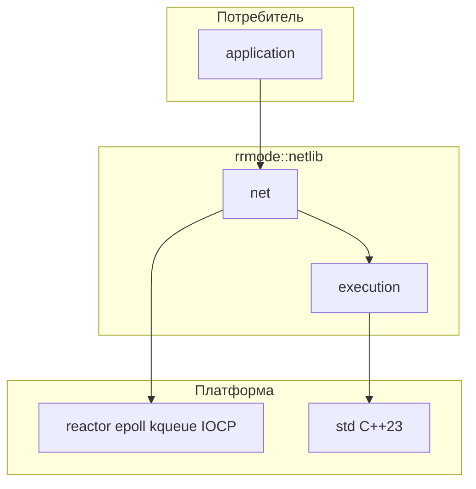

# Архитектура netlib

## Миссия

**netlib** — header-only библиотека на современном C++ для асинхронного выполнения задач и сетевого I/O. Целевой стандарт — **C++23**; поддерживаются только актуальные stable-версии компиляторов (GCC, Clang, MSVC).

Библиотека **не** дублирует Boost.Asio и не тянет внешние зависимости: только стандартная библиотека и тонкие платформенные обёртки в пространствах `detail`.

## Два слоя

Зависимости направлены **только вниз**: потребитель → `net` → `execution` → std / платформа.



### Слой `execution`

Отвечает за планирование и выполнение работы:

- executors и schedulers;
- композиция асинхронных операций (гибрид P2300 + fallback);
- таймеры и примитивы синхронизации;
- единая точка входа для «запустить эту работу на этом executor».

Публичные имена — `snake_case` (`executor`, `scheduler`, `operation`).

### Слой `net`

Сетевой I/O поверх reactor-модели:

- `event_loop` и регистрация дескрипторов;
- TCP (`tcp_socket`, `tcp_acceptor`) и UDP (`udp_socket`) на сыром IPv4;
- сокеты, адреса, endpoints;
- все завершения операций доставляются через scheduler из `execution`.

Платформенный код (`epoll`, `kqueue`, IOCP) живёт только в `rrmode::netlib::net::detail`.

### Правила границ

| Разрешено | Запрещено |
|-----------|-----------|
| `net` включает заголовки `execution` | `execution` включает `net` |
| Платформа в `::detail` | Платформенные `#include` в публичных заголовках |
| Исключения в публичном API | Внешние библиотеки (Boost, Asio, fmt, …) |

## Пространства имён и именование

Корень: **`rrmode::netlib`**.

| Слой | Namespace | Пример типа |
|------|-----------|-------------|
| execution | `rrmode::netlib::execution` | `thread_pool` |
| net | `rrmode::netlib::net` | `tcp_socket` |
| детали | `…::detail` | не в документации потребителя |

**Стиль:** `snake_case` для типов, функций и переменных.

```cpp
// include/netlib/net/tcp_socket.hpp
namespace rrmode::netlib::net {

class tcp_socket {
public:
    void connect(endpoint const& ep);
};

}  // namespace rrmode::netlib::net
```

Файлы зеркалят путь: `include/netlib/<слой>/<имя>.hpp`.

## Header-only и модули

Сейчас весь публичный API — заголовки в `include/netlib/`. Реализация инлайн или в `.ipp`, подключаемых из заголовка.

C++20 modules и `NETLIB_BUILD_MODULES` — опционально; единый источник остаётся в headers. См. [ROADMAP.md](ROADMAP.md).

## Три уровня API (net)

Потребитель выбирает глубину контроля. Зависимости слоёв: **simple → medium → full** (обратных include нет).

| Уровень | Namespace | Umbrella | Когда использовать |
|---------|-----------|----------|-------------------|
| **Simple** | `rrmode::netlib::net::simple` | `#include <netlib/simple.hpp>` | Массовые сценарии: скрытый `io_runtime`, sync connect/write/read, `write_stream` с `<<` |
| **Medium** | `rrmode::netlib::net::medium` | `#include <netlib/medium.hpp>` | `socket_options`, `io_context` с настройкой reactor/потоков |
| **Full** | `rrmode::netlib::net` | `#include <netlib/netlib.hpp>` | Колбэки, `io_handle()`, инъекция `socket_backend`, прямой `event_loop` |

Модули (при `NETLIB_BUILD_MODULES=ON`): `import netlib.net.simple;`, `import netlib.net.medium;`, `import netlib.net;` — зеркало umbrella-заголовков.

**Simple:** sync по умолчанию; `async_*` и coroutine-обёртки (`net/simple/coro.hpp`) опциональны. `conn.write() << 'a' << "b"` — буфер, flush в destructor или явно.

**Medium:** те же async-примитивы, что full, плюс применение `socket_options` к fd.

**Full:** без изменений семантики; каноническая реализация reactor I/O.

## Гибрид execution (P2300 + fallback)

### Зачем гибрид

| Подход | За | Против |
|--------|-----|--------|
| Только `std::execution` | Совместимость с будущим std | Неравномерная поддержка в toolchain |
| Только свой runtime | Предсказуемость | Дублирование экосистемы senders |
| **Гибрид netlib** | Один публичный API | Слой адаптации в `execution::detail::backend` |

### Схема

На этапе сборки CMake определяет макрос (см. будущий `cmake/netlib_features.cmake`):

```cmake
# NETLIB_HAS_STD_EXECUTION — результат probe (__cpp_lib_execution / try_compile)
target_compile_definitions(netlib::netlib INTERFACE
    $<$<BOOL:${NETLIB_HAS_STD_EXECUTION}>:NETLIB_HAS_STD_EXECUTION=1>
)
```

Публичный API остаётся стабильным. Внутри `execution::detail::backend`:

- при `NETLIB_HAS_STD_EXECUTION` — алиасы и адаптеры к `std::execution`;
- иначе — fallback: очередь задач, `std::thread`, минимальный dispatch завершений **без** coroutines.

Fallback **обязателен**, не «best effort»: библиотека должна собираться на toolchain без P2300.

### Публичные абстракции (целевые)

- `executor` — куда отправить работу;
- `scheduler` — откуда приходят завершения;
- `operation` — отменяемая единица работы с явным завершением.

Конкретные алгоритмы composition (`when_all`, `then`, …) добавляются поверх backend по мере готовности слоя.

## Reactor (слой `net`)

Модель: **reactor** — ожидание готовности дескрипторов, обработка событий в цикле.

```mermaid
sequenceDiagram
    participant App
    participant Socket as tcp_socket
    participant Loop as event_loop
    participant Exec as scheduler
    participant OS as epoll_kqueue_IOCP

    App->>Socket: async_read(buffer)
    Socket->>Loop: register(fd, interest)
    Loop->>OS: wait
    OS-->>Loop: readable
    Loop->>Exec: post(completion)
    Exec-->>App: callback / future
```

### Инварианты

- Один `event_loop` привязан к потоку (или явная документированная модель «loop per thread»).
- Регистрация fd не блокирует надолго поток loop.
- Завершения I/O не вызывают произвольный пользовательский код **внутри** системного wait — только через `execution`.

### Платформенные бэкенды (`net::detail`)

| ОС | API |
|----|-----|
| Linux | `epoll` |
| macOS, BSD | `kqueue` |
| Windows | IOCP |

Публичный API идентичен на всех платформах; различия скрыты за `#if` в `detail`.

## Обработка ошибок

Публичный API использует **исключения**:

- `std::logic_error` и производные — нарушение контракта API (неверный аргумент, состояние объекта);
- доменная иерархия `rrmode::netlib::…::error` (базовый класс + сетевые/системные подтипы) — сбои runtime;
- где уместно, исключение несёт `std::error_code` или эквивалент в `what()`.

Ожидаемые сетевые сбои (reset, timeout) — через доменные исключения, не через `std::logic_error`.

`std::expected` для hot path — кандидат на v2; см. [ROADMAP.md](ROADMAP.md).

## Coroutines

При `NETLIB_ENABLE_COROUTINES=1` (CMake, по умолчанию если toolchain поддерживает):

- `execution::task<T>`, `co_await scheduler`, `sync_wait(sched, task)`
- `when_all` (pair и `vector<task<T>>`), `spawn`, `generator<T>::next(sched)`
- `net/awaitables.hpp` / `net/udp_awaitables.hpp` — мост callback → `co_await` (TCP + UDP)

Заголовки: `execution/coroutine.hpp`, `net/coro.hpp`. Без макроса API остаётся callback-only.

## Подключение библиотеки

Потребитель подключает через CMake:

```cmake
add_subdirectory(path/to/netlib)   # или FetchContent
target_link_libraries(my_app PRIVATE netlib::netlib)
```

`netlib::netlib` — `INTERFACE` library с `target_include_directories` на `include/`.

`cmake --install` + `find_package` — в roadmap.

## Структура репозитория

```text
netlib/
├── include/netlib/
│   ├── execution/
│   └── net/
├── cmake/              # probes, compiler checks
├── docs/
├── tests/
└── CMakeLists.txt
```

Каталог `src/` — только тесты, бенчмарки и вспомогательные `.cpp`, не публичная библиотека.

## Тестирование

Подход **TDD** и фейки ОС/сети — см. [TESTING.md](TESTING.md).

- **Unit** (`netlib_unit_tests`): `fake_socket_backend`, `fake_reactor`, без реального epoll.
- **Integration** (`netlib_integration_tests`): loopback TCP, epoll, POSIX.
- Абстракции: `socket_backend`, `reactor_backend` — подмена в тестах.
- Catch2 v3, `TEST_CASE` на русском.

## Лицензия

MIT — см. `LICENSE` (добавится при первом релизе артефактов).

## Trade-offs (сводка)

| Решение | За | Против |
|---------|-----|--------|
| std-only | Простое vendoring | Больше своего кода |
| Hybrid P2300 | Выравнивание со std | Probes и два backend |
| Header-only | `add_subdirectory` из коробки | Время компиляции у потребителя |
| Reactor | Естественно для epoll/kqueue/IOCP | Разный `detail` на Windows |
| Исключения | Идиоматичный C++ API | Не для no-exceptions embedded |
| snake_case типы | Единообразие | Отличие от STL |

## Риски

1. **P2300** — даже на «latest» компиляторах probe может быть ложноотрицательным; fallback должен проходить CI всегда.
2. **IOCP vs epoll** — семантика edge/level и cancel; требуются отдельные тесты на каждой ОС.
3. **Header-only** — время сборки; позже — modules или amalgamation (roadmap).

## Связанные документы

- [README.md](README.md) — **оглавление всей документации**
- [EXECUTION.md](EXECUTION.md), [NET_REACTOR.md](NET_REACTOR.md), [NET_TCP.md](NET_TCP.md), [NET_UDP.md](NET_UDP.md)
- [COROUTINES.md](COROUTINES.md), [CANCELLATION_AND_TIMEOUT.md](CANCELLATION_AND_TIMEOUT.md), [LIFECYCLE.md](LIFECYCLE.md)
- [HEADERS_REFERENCE.md](HEADERS_REFERENCE.md) — карта заголовков
- [diagrams/](diagrams/) — исходники PlantUML
- [ROADMAP.md](ROADMAP.md) — отложенные возможности
- `.cursor/rules/netlib-*.mdc` — соглашения для агентов и разработчиков
