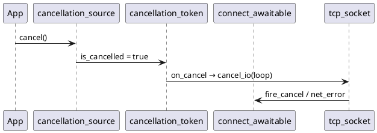

# Отмена и таймауты

## cancellation_token / cancellation_source

Файл: `net/cancellation_token.hpp`.



| Тип | Методы |
|-----|--------|
| `cancellation_source` | `cancel()`, `token()` |
| `cancellation_token` | `is_cancelled()`, `on_cancel(fn)`, `clear_on_cancel()` |

Awaitables вызывают `bind_cancel(token, socket, loop)` в `await_suspend`.

## cancel_io / cancel_accept

Низкий уровень (без token):

```cpp
socket.cancel_io(loop);      // unregister + флаг + fire_cancel
acceptor.cancel_accept(loop);
```

## with_timeout и when_any

Диаграмма: [diagrams/when_any_timeout.puml](diagrams/when_any_timeout.puml).

### Почему connect_with_timeout отменяет в catch

При гонке `connect_task` vs `timeout_after`:

- Если вызвать `token.cancel()` **из** `timeout_after` (до throw), connect может завершиться с `net_error("операция отменена")` **раньше**, чем `timeout_error`.
- `when_any` вернёт не тот тип исключения.

**Решение в netlib:** `*_with_timeout` ловят `timeout_error`, затем:

```cpp
src->cancel();
socket.close(loop);  // или cancel_accept
throw;
```

### on_loser_* (кооперативная отмена)

`when_any(sched, a, b, on_loser_a, on_loser_b)` — вызывается для проигравшей стороны, когда победитель уже определён.  
Проигравший task **сам** должен проверять флаги / token — принудительно уничтожать coroutine из другого потока нельзя (UB).

`with_timeout(..., on_work_lost)` — аналог для primary при победе таймаута.

## Таблица сценариев

| Сценарий | API |
|----------|-----|
| Graceful shutdown сервера | `cancellation_source` + `tcp_echo_server_loop` / `udp_echo_loop` / `unix_echo_server_loop` |
| Отмена одного connect | `connect_async(..., &token)` + `source.cancel()` |
| Лимит времени connect | `connect_with_timeout` / `connect_unix_with_timeout` |
| Гонка двух task | `when_any` + `on_loser_*` |
| Таймаут произвольной task | `with_timeout` |

## Ошибки

| Исключение | Когда |
|------------|-------|
| `execution::timeout_error` | `with_timeout`, `*_with_timeout` |
| `net::net_error` | I/O, «операция отменена», закрытый сокет |
| `execution::execution_error` | логика execution (pool shutdown, when_any void) |

## Тесты

- `cancellation_coro_tests`, `cancel_io_tests`, `accept_cancel_tests`
- `connect_timeout_tests`, `timeout_cancel_tests`
- `when_any_abort_tests`
- `server_coro_shutdown_tests`, `udp_server_coro_shutdown_tests`, `unix_server_coro_shutdown_tests`
