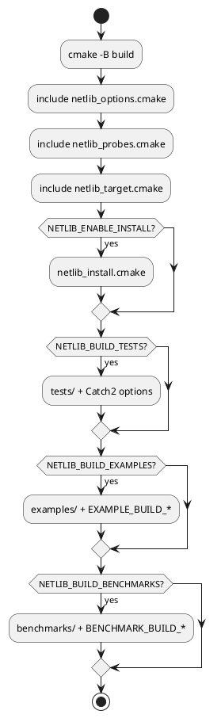

# Опции CMake

Корень: `CMakeLists.txt` подключает модули из `cmake/`:

| Файл | Назначение |
|------|------------|
| [netlib_options.cmake](../cmake/netlib_options.cmake) | Все `option()` / `CACHE` |
| [netlib_probes.cmake](../cmake/netlib_probes.cmake) | Probes + `NETLIB_ENABLE_COROUTINES` |
| [netlib_target.cmake](../cmake/netlib_target.cmake) | Target `netlib::netlib` |
| [netlib_install.cmake](../cmake/netlib_install.cmake) | `install` + package config |

## Язык и toolchain

| Опция | По умолчанию | Описание |
|-------|--------------|----------|
| `NETLIB_CXX_STANDARD` | `23` | `CMAKE_CXX_STANDARD` (20 или 23) |
| `NETLIB_CXX_STANDARD_REQUIRED` | ON | `CMAKE_CXX_STANDARD_REQUIRED` |
| `NETLIB_CXX_EXTENSIONS` | OFF | `CMAKE_CXX_EXTENSIONS` |

## Компоненты сборки

| Опция | По умолчанию | Описание |
|-------|--------------|----------|
| `NETLIB_BUILD_TESTS` | ON | Catch2: unit + integration |
| `NETLIB_BUILD_EXAMPLES` | OFF | `examples/` (см. `NETLIB_EXAMPLE_BUILD_*`) |
| `NETLIB_BUILD_BENCHMARKS` | OFF | `benchmarks/` (см. `NETLIB_BENCHMARK_BUILD_*`) |
| `NETLIB_BUILD_MODULES` | OFF | C++20 modules |
| `NETLIB_ENABLE_INSTALL` | ON | `cmake --install` + `find_package` |

## Библиотека

| Опция | По умолчанию | Описание |
|-------|--------------|----------|
| `NETLIB_ENABLE_COROUTINES` | auto (probe) | `NETLIB_ENABLE_COROUTINES=1` на interface |
| `NETLIB_ENABLE_STD_EXECUTION` | ON | Define `NETLIB_HAS_STD_EXECUTION` если probe OK |
| `NETLIB_USE_THREADS` | ON | `Threads::Threads` |
| `NETLIB_LINK_WINSOCK` | ON | `ws2_32` на Windows |
| `NETLIB_PACKAGE_COMPATIBILITY` | `SameMajorVersion` | Версия для `find_package` |

## Catch2 (`NETLIB_BUILD_TESTS`)

| Опция | По умолчанию |
|-------|--------------|
| `NETLIB_CATCH2_REPOSITORY` | `https://github.com/catchorg/Catch2.git` |
| `NETLIB_CATCH2_TAG` | `v3.7.1` |
| `NETLIB_CATCH2_GIT_SHALLOW` | ON |

## Примеры (`NETLIB_BUILD_EXAMPLES`)

| Опция | По умолчанию | Описание |
|-------|--------------|----------|
| `NETLIB_EXAMPLE_BUILD_TCP` | ON | `examples/tcp_echo` |
| `NETLIB_EXAMPLE_BUILD_UDP` | ON | `examples/udp_echo` |
| `NETLIB_EXAMPLE_BUILD_UNIX` | ON | `examples/unix_echo` |
| `NETLIB_EXAMPLES_REQUIRE_POSIX` | ON | На Windows не собирать examples |

## Benchmarks (`NETLIB_BUILD_BENCHMARKS`)

| Опция | По умолчанию | Описание |
|-------|--------------|----------|
| `NETLIB_BENCHMARK_BUILD_SCHEDULE` | ON | `schedule_bench` |
| `NETLIB_BENCHMARK_BUILD_NETWORK` | ON | `tcp_echo_bench`, `udp_ping_bench` |
| `NETLIB_BENCHMARKS_REQUIRE_POSIX` | ON | Сетевые bench только Linux/macOS |
| `NETLIB_BENCHMARKS_REQUIRE_COROUTINES` | ON | Сетевые bench только с coroutines |

## Автоопределение (read-only после configure)

| Переменная | Файл probe |
|------------|------------|
| `NETLIB_HAS_COROUTINES` | `netlib_coroutines.cmake` |
| `NETLIB_HAS_STD_EXECUTION` | `netlib_features.cmake` |
| `NETLIB_HAS_MODULES` | `netlib_modules.cmake` |
| `NETLIB_STD_EXECUTION_ACTIVE` | `netlib_probes.cmake` |

## Типичные конфигурации

### Разработка (полная)

```bash
cmake -B build -DCMAKE_BUILD_TYPE=Debug \
  -DNETLIB_BUILD_TESTS=ON \
  -DNETLIB_BUILD_EXAMPLES=ON \
  -DNETLIB_ENABLE_COROUTINES=ON
```

### CI-подобная

```bash
cmake -B build -DCMAKE_BUILD_TYPE=Debug \
  -DNETLIB_BUILD_TESTS=ON \
  -DNETLIB_BUILD_BENCHMARKS=ON \
  -DNETLIB_BUILD_EXAMPLES=ON \
  -DNETLIB_ENABLE_COROUTINES=ON
```

### Потребитель (только headers)

```bash
cmake -B build -DCMAKE_BUILD_TYPE=Release \
  -DNETLIB_BUILD_TESTS=OFF \
  -DNETLIB_BUILD_EXAMPLES=OFF \
  -DNETLIB_ENABLE_INSTALL=ON
cmake --install build --prefix $PREFIX
```

### Без coroutines

```bash
cmake -B build -DNETLIB_ENABLE_COROUTINES=OFF
```

### Только unit-тесты, свой Catch2

```bash
cmake -B build -DNETLIB_BUILD_TESTS=ON \
  -DNETLIB_CATCH2_TAG=v3.7.1
```

### Примеры: только TCP

```bash
cmake -B build -DNETLIB_BUILD_EXAMPLES=ON \
  -DNETLIB_EXAMPLE_BUILD_UDP=OFF \
  -DNETLIB_EXAMPLE_BUILD_UNIX=OFF
```

## Target

| Target | Тип | Назначение |
|--------|-----|------------|
| `netlib::netlib` | INTERFACE | Основная зависимость |
| `netlib::simple` | MODULE/IFACE | при `NETLIB_BUILD_MODULES` |
| `netlib::medium` | MODULE/IFACE | при `NETLIB_BUILD_MODULES` |

## Диаграмма сборки



## Связанные документы

- [INSTALL.md](INSTALL.md)
- [TESTING.md](TESTING.md)
- [BENCHMARKS.md](BENCHMARKS.md)
