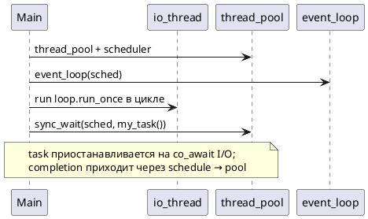

# Coroutines

Включается опцией CMake `NETLIB_ENABLE_COROUTINES=ON` (по умолчанию, если toolchain поддерживает C++20 coroutines).

## Заголовки

```cpp
#include <netlib/execution/coroutine.hpp>  // task, when_all, when_any, delay, spawn, generator
#include <netlib/net/coro.hpp>             // awaitables + tcp/udp helpers + timeout
```

## Мост callback → awaitable

Каждый awaitable — struct с `await_ready` / `await_suspend` / `await_resume`, внутри вызывает `async_*` и `coroutine_handle::resume`.

Диаграмма последовательности: [diagrams/coro_awaitable.puml](diagrams/coro_awaitable.puml).

## sync_wait и фоновый loop



Минимальный шаблон — `examples/common/io_runner.hpp`.

## Композиция execution

| API | Пример |
|-----|--------|
| `when_all(sched, a, b)` | сервер + клиент в одном `sync_wait` |
| `when_all(sched, vector<task<T>>)` | пул воркеров |
| `when_all(sched, t1, t2, t3)` | tuple из 3+ результатов |
| `when_any(sched, fast, slow)` | гонка |
| `with_timeout(sched, work, 5s)` | таймаут |
| `then(sched, t, fn)` | map после task |
| `spawn(sched, detached)` | фоновый echo-сервер в bench |
| `delay_async(sched, ms)` | пауза |
| `generator::next(sched)` | поток значений |

## TCP хелперы

`coro_tcp.hpp` / `tcp_coro.hpp`:

- `read_string_async`, `read_exact_vec_async`
- `tcp_echo_peer`, `tcp_serve_echo_once`
- `tcp_echo_server_loop(acceptor, loop, &token)`
- `tcp_connect` (+ overload с `connect_with_timeout`)

## UDP хелперы

`udp_coro.hpp`:

- `udp_send_string`, `udp_recv_string`
- `udp_echo_once`, `udp_echo_loop`

## Ограничения

1. **Не** использовать unnamed lambda-coroutine внутри `when_all` vector — использовать именованные `task` или отдельные функции.
2. Буфер `std::span` в `async_recv_from` / `read_some` должен жить до завершения операции (стек вызывающей coroutine обычно OK).
3. `sync_wait` из колбэка reactor — запрещён (deadlock).

## Связанные документы

- [CANCELLATION_AND_TIMEOUT.md](CANCELLATION_AND_TIMEOUT.md)
- [API_LAYERS.md](API_LAYERS.md)
- [GETTING_STARTED.md](GETTING_STARTED.md)
