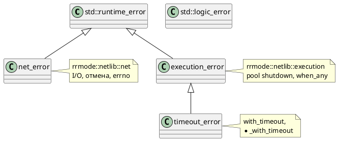

# Ошибки и исключения

Публичный API netlib использует **исключения** (не `std::expected` на hot path — см. [ROADMAP.md](ROADMAP.md)).

## Иерархия

## net_error

Файл: `net/error.hpp`.

Типичные сообщения (подстроки):

| Ситуация | Пример `what()` |
|----------|-----------------|
| Отмена I/O | `операция отменена` |
| Закрытый сокет | `сокет закрыт`, `сокет не открыт` |
| Системный вызов | `connect: Connection refused` |
| Контракт API | `async_connect: колбэки обязательны` |
| UDP/TCP mismatch на фейке | `используйте recvfrom для UDP` |

**Обработка:** `catch (net_error const& e)` в колбэках `on_error` или вокруг `sync_wait`.

## execution_error

Файл: `execution/error.hpp`.

| Ситуация | Пример |
|----------|--------|
| `schedule` после `pool.shutdown()` | `post в остановленный thread_pool` |
| `when_any` void competitor без исключения | `competitor завершился без исключения` |

## timeout_error

Файл: `execution/timeout_error.hpp`, namespace `execution`.

Наследник `execution_error`. Бросается из:

- `with_timeout`, `timeout_after`
- `connect_with_timeout`, `read_*_with_timeout`, `accept_with_timeout`
- `send_to_with_timeout`, `recv_from_with_timeout`

После catch в `*_with_timeout` часто следует `cancellation_source::cancel()` и `close` — см. [CANCELLATION_AND_TIMEOUT.md](CANCELLATION_AND_TIMEOUT.md).

## std::logic_error

Не доменный класс netlib — нарушение предусловий API (nullptr колбэки передаются как `net_error` в части мест). В тестах: `REQUIRE_THROWS_AS(..., net_error)`.

## Рекомендации

1. **Сетевой код** — ловить `net_error` отдельно от `std::exception`.
2. **Таймауты** — `timeout_error` перед общим `execution_error`.
3. **Не** полагаться на точный текст `what()` в production (кроме стабильных подстрок вроде «отменена» в тестах).
4. Отмена через token — ожидайте `net_error`, не `timeout_error`, если не используете `*_with_timeout`.

## Связанные документы

- [CANCELLATION_AND_TIMEOUT.md](CANCELLATION_AND_TIMEOUT.md)
- [TESTING.md](TESTING.md) — `REQUIRE_THROWS_AS`
