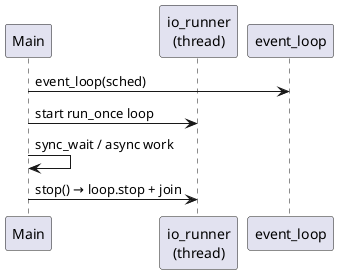
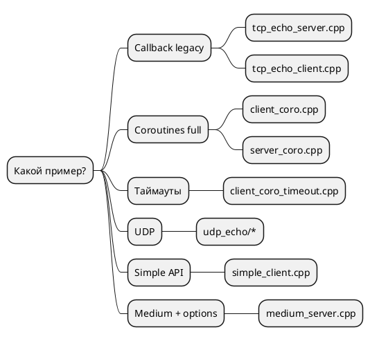

# Примеры

Каталоги: `examples/tcp_echo/`, `examples/udp_echo/`, `examples/unix_echo/`, общий `examples/common/io_runner.hpp`.

Сборка:

```bash
cmake -B build -DNETLIB_BUILD_EXAMPLES=ON -DNETLIB_ENABLE_COROUTINES=ON
cmake --build build -j
```

На Windows примеры **не** собираются (см. `examples/CMakeLists.txt`).

## Общий паттерн: io_runner



`io_runner` крутит `loop.run_once(10ms)` пока не вызван `stop()`.

## TCP echo

| Бинарник | API | Порт | Запуск |
|----------|-----|------|--------|
| `tcp_echo_server` | callback | 9001 | `./build/examples/tcp_echo/tcp_echo_server [port]` |
| `tcp_echo_client` | callback | 9001 | `.../tcp_echo_client [port] [msg] [host]` |
| `tcp_echo_simple_client` | simple | — | упрощённый клиент |
| `tcp_echo_medium_server` | medium | — | сервер с `socket_options` |
| `tcp_echo_client_coro` | coro | 9001 | нужен `NETLIB_ENABLE_COROUTINES` |
| `tcp_echo_server_coro` | coro | 9001 | Enter — `cancellation_source` |
| `tcp_echo_client_coro_timeout` | coro + timeout | 9001 | `connect_with_timeout`, `read_string_with_timeout` |

### Сценарий проверки (два терминала)

```bash
# T1
./build/examples/tcp_echo/tcp_echo_server_coro 9001

# T2
./build/examples/tcp_echo/tcp_echo_client_coro 9001 hello
```

Ожидание: ответ `hello`.

### Что смотреть в коде

| Файл | Учит |
|------|------|
| `server.cpp` | цепочка `async_read_some` → `io_handle` → `async_write_all` |
| `client_coro.cpp` | `connect_async`, `write_all_async`, `read_string_async` |
| `server_coro.cpp` | `tcp_echo_server_loop`, graceful shutdown |

## UDP echo

| Бинарник | API | Порт |
|----------|-----|------|
| `udp_echo_server` | callback (рекурсивный recv) | 9002 |
| `udp_echo_client_coro` | coro | 9002 |
| `udp_echo_server_coro` | `udp_echo_loop` + cancel | 9002 |

```bash
./build/examples/udp_echo/udp_echo_server_coro 9002
./build/examples/udp_echo/udp_echo_client_coro 9002 ping
```

## UNIX echo (POSIX, coroutines)

| Бинарник | API | Аргументы |
|----------|-----|-----------|
| `unix_echo_server_coro` | `unix_echo_server_loop` + cancel | `[socket-path]` |
| `unix_echo_client_coro` | coro ping | `<socket-path> [message]` |
| `unix_echo_client_coro_timeout` | connect/read с таймаутом 5s | `<socket-path> [message]` |

```bash
./build/examples/unix_echo/unix_echo_server_coro /tmp/my.sock
./build/examples/unix_echo/unix_echo_client_coro /tmp/my.sock hello-unix
./build/examples/unix_echo/unix_echo_client_coro_timeout /tmp/my.sock hello-unix
```

## Выбор примера под задачу



## Связанные документы

- [API_LAYERS.md](API_LAYERS.md)
- [COROUTINES.md](COROUTINES.md)
- [GETTING_STARTED.md](GETTING_STARTED.md)
