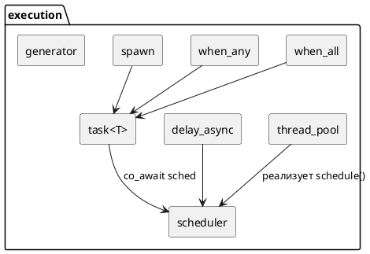
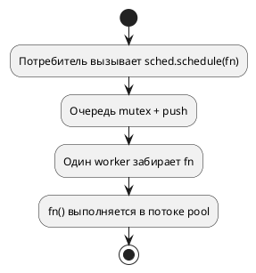
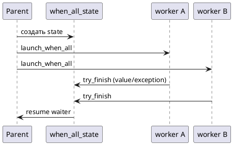

# Слой execution

Пространство имён: `rrmode::netlib::execution`.  
Задача слоя — **куда** отправить работу и **откуда** безопасно возобновить coroutine / вызвать колбэк. Сеть (`net`) не знается.

## Компоненты

| Тип | Файл | Роль |
|-----|------|------|
| `thread_pool` | `thread_pool.hpp` | Пул потоков + очередь `std::function<void()>` |
| `scheduler` | `scheduler.hpp` | Обёртка над `executor`; `schedule(fn)` |
| `task<T>` | `task.hpp` | Coroutine с `co_await` / `co_return` |
| `sync_wait` | `task.hpp` | Блокирует поток до завершения `task` |
| `when_all` | `when_all.hpp` | Ждать N задач (pair, vector, tuple 3+) |
| `when_any` | `when_any.hpp` | Первый завершившийся; таймауты |
| `then` | `then.hpp` | Последовательная композиция |
| `delay_async` | `delay.hpp` | `co_await` задержки через scheduler |
| `spawn` | `spawn.hpp` | Detached task |
| `generator<T>` | `generator.hpp` | Ленивая последовательность + `next(sched)` |

## Поток выполнения thread_pool

**Инварианты:**

- Колбэки из `schedule` не должны блокироваться надолго (не вызывать `sync_wait` на том же pool без осторожности — риск deadlock).
- `pool.shutdown()` — workers завершаются после опустошения очереди; новые `schedule` бросают `execution_error`.

## task и promise

`task<T>` — move-only, не копируется. Внутри `detail::task_promise_storage`:

- `continuation` — кто возобновить после `co_await child`;
- `sync_ctx` — для `sync_wait` (condition_variable);
- `exception` / `optional<T> value`.

`final_suspend` планирует продолжение через `scheduler`, а не inline resume в worker pool (избегаем stack overflow при глубокой цепочке).

## when_all

Варианты:

1. Два `task<T>` / `task<void>` — shared state, счётчик готовности.
2. `vector<task<T>>` — именованные worker-корутины (не lambda-coroutine внутри vector: был SIGSEGV).
3. Три и более не-void — `std::tuple` (`detail/when_all_tuple.hpp`).
4. `void` + `T` — результат стороны `T`.

## when_any и таймауты

См. [CANCELLATION_AND_TIMEOUT.md](CANCELLATION_AND_TIMEOUT.md) и `diagrams/when_any_timeout.puml`.

Кратко:

- `when_any(sched, a, b, on_loser_a, on_loser_b)` — колбэки для **кооперативной** отмены проигравшей стороны.
- `with_timeout(sched, work, limit, on_expired, on_work_lost)` — гонка `work` vs `delay_async` + `timeout_error`.

## P2300 / fallback

CMake: `NETLIB_HAS_STD_EXECUTION` (probe в `cmake/netlib_features.cmake`).

| Режим | Поведение |
|-------|-----------|
| ON | `execution/detail/std/backend.hpp` — адаптация к std execution (заготовка) |
| OFF | `thread_pool` + очередь — **обязательный** путь CI |

Публичные типы (`scheduler`, `task`) не меняются между режимами.

## CMake

| Опция | Эффект |
|-------|--------|
| `NETLIB_ENABLE_COROUTINES` | `NETLIB_ENABLE_COROUTINES=1`, подключается `execution/coroutine.hpp` |
| `NETLIB_HAS_STD_EXECUTION` | Макрос для std backend |

## Связанные документы

- [COROUTINES.md](COROUTINES.md) — net + execution вместе
- [NET_REACTOR.md](NET_REACTOR.md) — кто вызывает `scheduler::schedule` при I/O
- [ARCHITECTURE.md](ARCHITECTURE.md) — границы слоёв
