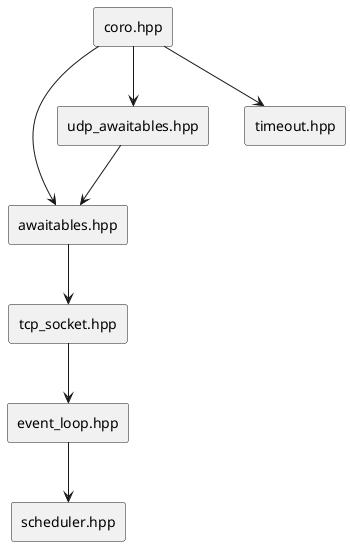

# Справочник заголовков

Корень include: `include/netlib/`. Все пути — относительно `#include <netlib/...>`.

## Umbrella

| Заголовок | Включает |
|-----------|----------|
| `netlib.hpp` | execution base + net; при coroutines — `coro.hpp` |
| `simple.hpp` | `net::simple` |
| `medium.hpp` | `net::medium` |
| `config.hpp` | макросы `NETLIB_*` |

## execution/

| Файл | Содержание |
|------|------------|
| `executor.hpp` | Абстракция исполнителя |
| `scheduler.hpp` | `schedule()` |
| `thread_pool.hpp` | Пул + очередь |
| `task.hpp` | `task<T>`, `sync_wait` |
| `error.hpp` | `execution_error` |
| `operation.hpp` | Заготовка отменяемой операции |
| `coroutine.hpp` | Всё для coroutines |
| `schedule_awaitable.hpp` | `co_await sched` |
| `when_all.hpp` | Композиция |
| `when_any.hpp` | Гонка, `with_timeout`, `timeout_after` |
| `timeout_error.hpp` | `timeout_error` |
| `then.hpp` | `then` |
| `delay.hpp` | `delay_async` |
| `spawn.hpp` | `spawn` |
| `generator.hpp` | `generator<T>` |
| `detail/backend.hpp` | std vs fallback |
| `detail/task_promise.hpp` | promise type |
| `detail/when_all_state.hpp` | shared state |
| `detail/when_all_tuple.hpp` | variadic tuple |
| `detail/std/backend.hpp` | P2300 (если есть) |

## net/ (публичное)

| Файл | Содержание |
|------|------------|
| `endpoint.hpp` | host:port |
| `error.hpp` | `net_error` |
| `event_loop.hpp` | reactor loop |
| `tcp_socket.hpp` | TCP client socket |
| `tcp_acceptor.hpp` | TCP listener |
| `udp_socket.hpp` | UDP datagram |
| `unix_endpoint.hpp` | путь AF_UNIX |
| `unix_stream_socket.hpp` | UNIX stream client |
| `unix_stream_acceptor.hpp` | UNIX stream listener |
| `unix_awaitables.hpp` | UNIX coroutine awaitables |
| `coro_unix.hpp` | `unix_echo_peer`, `read_unix_string_async` |
| `unix_coro.hpp` | `unix_echo_server_loop` |
| `awaitables.hpp` | TCP awaitables |
| `udp_awaitables.hpp` | UDP awaitables |
| `cancellation_token.hpp` | token/source |
| `timeout.hpp` | `*_with_timeout` |
| `delay.hpp` | `delay_async(loop, …)` |
| `coro_tcp.hpp` | TCP string/echo helpers |
| `tcp_coro.hpp` | TCP connect/echo loop |
| `udp_coro.hpp` | UDP string/echo loop |
| `coro.hpp` | umbrella coro net |

## net/detail (платформа, не для потребителя)

| Файл | Содержание |
|------|------------|
| `socket_backend.hpp` | Абстракция ОС |
| `posix_socket_backend.hpp` | Linux/macOS |
| `win_socket_backend.hpp` | Windows |
| `default_socket_backend.hpp` | фабрика |
| `socket_handle.hpp` | shared fd |
| `reactor_backend.hpp` | интерфейс reactor |
| `epoll_reactor.hpp` | Linux |
| `kqueue_reactor.hpp` | macOS |
| `poll_reactor.hpp` | poll |
| `make_reactor.hpp` | `make_default_reactor` |
| `timer_scheduler.hpp` | интерфейс таймеров |
| `linux_timer_scheduler.hpp` | timerfd |
| `kqueue_timer_scheduler.hpp` | kqueue timer |
| `fallback_timer_scheduler.hpp` | steady_clock |
| `poll_event.hpp` | readable/writable |

## net/simple, net/medium

| Путь | Роль |
|------|------|
| `simple/io_runtime.hpp` | Скрытый loop + pool |
| `simple/tcp_connection.hpp` | sync + async |
| `simple/write_stream.hpp` | operator<< flush |
| `simple/coro.hpp` | thin coro |
| `medium/io_context.hpp` | Настройка loop |
| `medium/socket_options.hpp` | опции fd |
| `medium/tcp_socket.hpp` | обёртка |

## Зависимости include (упрощённо)

## Связанные документы

- [API_LAYERS.md](API_LAYERS.md)
- [README.md](README.md) — навигация
