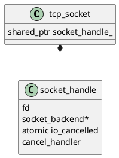
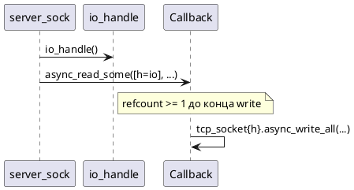

# Lifetime сокетов и async-операций

## Проблема

`tcp_socket` владеет `shared_ptr<socket_handle>`. При **move** объекта в лямбду до старта `async_*` последний внешний владелец может исчезнуть → fd закрывается → гонки.

## socket_handle



- `begin_io()` — сброс флага отмены.
- `request_cancel()` + `fire_cancel(err)` — доставка ошибки в ожидающий async.
- Деструктор handle закрывает fd, если `fd >= 0`.

## io_handle()

```cpp
auto h = sock.io_handle();  // shared_ptr копия
sock = {};  // tcp_socket пуст, fd живёт в h
tcp_socket{h}.async_write_all(...);  // OK
```

**Правило из INSTALL/GETTING_STARTED:** не `capture std::move(sock)` в колбэк **до** вызова async на этом же объекте.

## udp_socket

Тот же `socket_handle` и `cancel_io`. Нет отдельного acceptor.

## Coroutine lifetime

Coroutines хранят ссылки на `tcp_socket&` / буферы на стеке кадра — пока `sync_wait` не вернулся, кадр жив.  
`vector<char>` для `write_all_async` move в awaitable — владение внутри операции.

## Диаграмма: правильная цепочка echo (TCP)



## Связанные документы

- [NET_TCP.md](NET_TCP.md)
- [GETTING_STARTED.md](GETTING_STARTED.md)
- [INSTALL.md](INSTALL.md)
