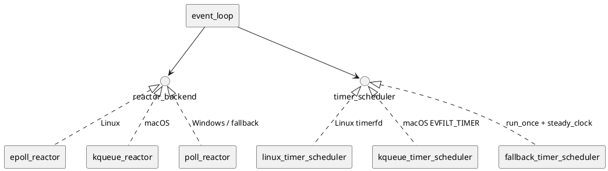
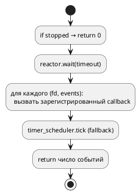

# Reactor и event_loop

`rrmode::netlib::net::event_loop` — единая точка ожидания готовности fd и доставки колбэков через `execution::scheduler`.

## Архитектура



Фабрика: `detail/make_default_reactor()` в `make_reactor.hpp`.

| ОС | Reactor | Таймеры `run_after` |
|----|---------|---------------------|
| Linux | `epoll_reactor` | `timerfd` + epoll (`linux_timer_scheduler`) |
| macOS | `kqueue_reactor` | EVFILT_TIMER в том же kqueue |
| Иное / Windows | `poll_reactor` + winsock | `fallback_timer_scheduler` |

`event_loop::uses_kernel_timers()` — true, если таймеры в ядре (не опрос часов в `run_once`).

## Цикл run_once



Типичное использование в приложении:

```cpp
std::thread io{[&] {
  while (!stop) loop.run_once(10ms);
}};
```

Пример обёртки: `examples/common/io_runner.hpp`.

## Регистрация fd

```cpp
loop.register_fd(fd, detail::poll_event::readable, [](detail::poll_event ev) {
    // обработка; обычно unregister + sync recv/send
});
```

- `modify_fd` — обновить интерес и колбэк (epoll MOD вместо повторного ADD).
- `unregister_fd` — снять с reactor (обязательно при отмене I/O).

**Правило:** колбэк reactor должен быть коротким — тяжёлую работу переносить в `scheduler.schedule`.

## Связь с tcp_socket / udp_socket

Сокеты **не** блокируют в reactor thread:

1. `try_recv` / `try_send` / `try_sendto` → `nullopt` при EAGAIN.
2. Регистрация `readable` / `writable`.
3. При событии — повтор `try_*`, затем `scheduler.schedule(user_callback)`.

## Тестирование

- Unit: `fake_reactor` + `fake_socket_backend` — без epoll.
- Integration: реальный loopback + `run_once` в фоне.

См. [TESTING.md](TESTING.md).

## Связанные документы

- [NET_TCP.md](NET_TCP.md) — кто регистрирует connect/read/write
- [NET_UDP.md](NET_UDP.md) — recvfrom/sendto
- [diagrams/tcp_async_connect.puml](diagrams/tcp_async_connect.puml)
