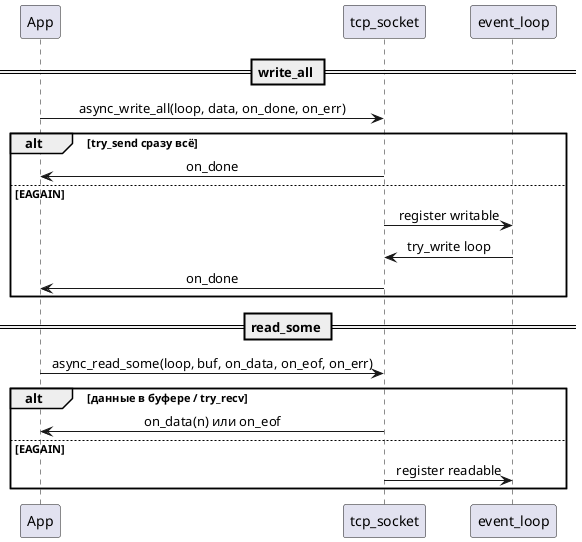

# TCP (транспорт + async API)

IPv4, потоковые сокеты. Без TLS и без отдельного DNS-модуля: имя хоста в `endpoint` разрешается через `getaddrinfo` в `posix_socket_backend` / `win_socket_backend`.

## Типы

| Класс | Файл | Назначение |
|-------|------|------------|
| `endpoint` | `endpoint.hpp` | `host` + `port` |
| `tcp_socket` | `tcp_socket.hpp` | connect, read, write |
| `tcp_acceptor` | `tcp_acceptor.hpp` | bind, listen, accept |

## async_connect

См. [diagrams/tcp_async_connect.puml](diagrams/tcp_async_connect.puml).



## Lifetime и io_handle()

Критично для цепочек колбэков: `tcp_socket` move в лямбду **до** старта async может закрыть fd.

**Паттерн:**

```cpp
auto io = server_sock.io_handle();
server_sock.async_read_some(loop, buf,
    [io, &loop](std::size_t n) {
        tcp_socket{io}.async_write_all(loop, ...);
    }, ...);
```

Подробнее: [LIFECYCLE.md](LIFECYCLE.md).

## tcp_acceptor

- `open(endpoint)` — bind + listen, порт 0 → `get_local_port`.
- `async_accept(loop, on_socket, on_error)` — неблокирующий accept или ожидание readable.
- `cancel_accept(loop)` — снять ожидание + ошибка «отменена».

## Coroutine-обёртки

| Callback | Awaitable |
|----------|-----------|
| `async_connect` | `connect_async` |
| `async_write_all` | `write_all_async` |
| `async_read_some` | `read_some_async` |
| `read_exact` (цикл) | `read_exact_async` |
| `async_accept` | `accept_async` |

Хелперы: `coro_tcp.hpp`, `tcp_coro.hpp` — см. [COROUTINES.md](COROUTINES.md).

## Отмена

```cpp
socket.cancel_io(loop);   // connect / read / write
acceptor.cancel_accept(loop);
```

С `cancellation_token` в awaitables — `token->on_cancel` вызывает то же. См. [CANCELLATION_AND_TIMEOUT.md](CANCELLATION_AND_TIMEOUT.md).

## Опции сокета (medium)

`net::medium::socket_options` + `apply_socket_options` — TCP_NODELAY, буферы, keepalive, linger.  
Simple/Medium оборачивают full API — [API_LAYERS.md](API_LAYERS.md).

## Примеры

| Пример | API |
|--------|-----|
| `examples/tcp_echo/server.cpp` | callback |
| `examples/tcp_echo/client.cpp` | callback |
| `examples/tcp_echo/server_coro.cpp` | `tcp_echo_server_loop` |
| `examples/tcp_echo/client_coro.cpp` | awaitables |

## Тесты

- Unit: `tests/unit/net/tcp_socket_*`, фейки.
- Integration: `tests/integration/tcp_echo_tests.cpp`, `tcp_echo_coro_tests.cpp`.
