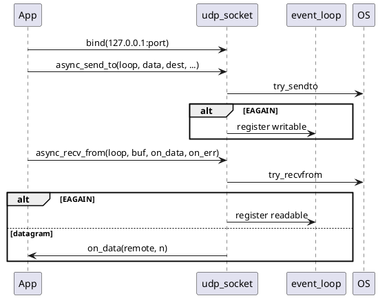

# UDP (транспорт)

Connectionless IPv4 datagrams. Уровень **только сырой сокет**: `bind`, `sendto`, `recvfrom`. Без `connect`/`listen`, без multicast, без IPv6, **без async DNS**.

## socket_backend

Расширения абстракции `detail/socket_backend`:

```cpp
int create_udp_socket();
std::optional<std::size_t> try_sendto(int fd, std::span<char const> buf, endpoint const& dest);
std::optional<std::size_t> try_recvfrom(int fd, std::span<char> buf, endpoint& out_remote);
```

`bind_endpoint` определяет тип сокета через `getsockopt(SO_TYPE)` и выбирает `SOCK_STREAM` vs `SOCK_DGRAM` для `getaddrinfo`.

## udp_socket



| Метод | Описание |
|-------|----------|
| `bind(ep)` | Создать UDP fd, reuseaddr, non-blocking bind |
| `local_endpoint()` | host + назначенный порт |
| `async_send_to` | Одна датаграмма |
| `async_recv_from` | Одна датаграмма + адрес отправителя |
| `cancel_io` | Как TCP |

## Coroutine API

Заголовки: `udp_awaitables.hpp`, `udp_coro.hpp` (через `net/coro.hpp`).

| Awaitable / хелпер | Назначение |
|--------------------|------------|
| `send_to_async` | `co_await` отправки |
| `recv_from_async` | `co_await` → `udp_recv_result{remote, bytes}` |
| `udp_send_string` / `udp_recv_string` | string convenience |
| `udp_echo_once` / `udp_echo_loop` | echo + shutdown по token |

Таймауты: `send_to_with_timeout`, `recv_from_with_timeout` в `timeout.hpp`.

## Маршрутизация в фейках (unit)

`fake_socket_backend`:

- `link_udp(a, b)` — доставка между двумя fd.
- `route_datagram` — по `dest.port` → сокет с `bound_port`.

## Примеры

```bash
./build/examples/udp_echo/udp_echo_server 9002
./build/examples/udp_echo/udp_echo_server_coro 9002
./build/examples/udp_echo/udp_echo_client_coro 9002 msg
```

## Тесты

- `tests/unit/net/udp_socket_tests.cpp`
- `tests/unit/net/udp_coro_tests.cpp`
- `tests/integration/udp_loopback_tests.cpp`
- `tests/integration/udp_echo_coro_tests.cpp`
- `tests/integration/udp_server_coro_shutdown_tests.cpp`

## Связанные документы

- [API_LAYERS.md](API_LAYERS.md)
- [COROUTINES.md](COROUTINES.md)
- [NET_REACTOR.md](NET_REACTOR.md)
