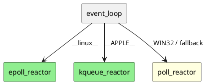

# Платформы и возможности

## Матрица

| Возможность | Linux | macOS | Windows |
|-------------|-------|-------|---------|
| `thread_pool` + unit tests | да | да | да |
| TCP callback (full) | да | да | да (Winsock) |
| TCP integration echo | да | да | нет |
| UDP socket + integration | да | да | нет |
| Coroutines | да | да | да (если toolchain) |
| Reactor | epoll | kqueue | WSAPoll |
| Kernel timers `run_after` | timerfd | EVFILT_TIMER | fallback (steady_clock) |
| Examples tcp/udp | да | да | пропуск |
| Benchmarks tcp/udp | да | да | только `schedule_bench` |

## Reactor

Фабрика: `detail/make_default_reactor()` в `make_reactor.hpp`.

## Разрешение имён (не DNS-модуль)

`posix_socket_backend::resolve_ipv4` / Win32 аналог вызывает **`getaddrinfo`** с `AF_INET` при:

- `start_connect` (TCP)
- `bind_endpoint` (тип сокета из `SO_TYPE`)
- `try_sendto` (UDP)

Это синхронный резолв в потоке вызывающего async API, **не** отдельный async DNS resolver.

## CI (.github/workflows/ci.yml)

| Job | Compiler | Сборка |
|-----|----------|--------|
| linux | GCC, Clang | tests + examples + benchmarks + coroutines |
| macos | Apple Clang | то же |
| windows | MSVC | tests (Debug) |

## Ограничения v1

- Полноценный **IOCP** на Windows — v2; v1 — WSAPoll smoke.
- **IPv6**, multicast, UNIX domain — отложено ([ROADMAP.md](ROADMAP.md)).
- **TLS** — вне scope без std или явной dep.

## Связанные документы

- [NET_REACTOR.md](NET_REACTOR.md)
- [INSTALL.md](INSTALL.md)
- [TESTING.md](TESTING.md)
