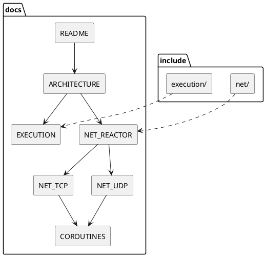

# Документация netlib

Полное описание библиотеки — в **Markdown** (`docs/*.md`) и **PlantUML** (`docs/diagrams/*.puml`). Doxygen/mkdocs **не** используются.

## С чего начать

| Документ | Для кого |
|----------|----------|
| [GETTING_STARTED.md](GETTING_STARTED.md) | Первый код, CMake, coroutines |
| [INSTALL.md](INSTALL.md) | `find_package`, установка |
| [API_LAYERS.md](API_LAYERS.md) | Callback → coro → хелперы |
| [EXAMPLES.md](EXAMPLES.md) | Все бинарники `examples/` |
| [DEVELOPMENT.md](DEVELOPMENT.md) | Локальная разработка, TDD, CI |

## Архитектура

| Документ | Содержание |
|----------|------------|
| [ARCHITECTURE.md](ARCHITECTURE.md) | Миссия, границы, trade-offs |
| [EXECUTION.md](EXECUTION.md) | `thread_pool`, `task`, композиция |
| [NET_REACTOR.md](NET_REACTOR.md) | `event_loop`, epoll/kqueue/poll, таймеры |
| [NET_TCP.md](NET_TCP.md) | TCP async, acceptor |
| [NET_UDP.md](NET_UDP.md) | UDP datagram |
| [NET_UNIX.md](NET_UNIX.md) | AF_UNIX SOCK_STREAM |
| [SIMPLE_MEDIUM.md](SIMPLE_MEDIUM.md) | `simple.hpp`, `medium.hpp` |
| [COROUTINES.md](COROUTINES.md) | awaitables, `when_all` / `when_any` |
| [CANCELLATION_AND_TIMEOUT.md](CANCELLATION_AND_TIMEOUT.md) | token, таймауты |
| [LIFECYCLE.md](LIFECYCLE.md) | `io_handle()`, колбэки |

## Справочник

| Документ | Содержание |
|----------|------------|
| [HEADERS_REFERENCE.md](HEADERS_REFERENCE.md) | Карта `include/netlib/**` |
| [ERRORS.md](ERRORS.md) | `net_error`, `timeout_error`, … |
| [CMAKE_OPTIONS.md](CMAKE_OPTIONS.md) | Опции сборки |
| [PLATFORMS.md](PLATFORMS.md) | Linux / macOS / Windows |
| [TESTING.md](TESTING.md) | Фейки, Catch2 |
| [BENCHMARKS.md](BENCHMARKS.md) | Throughput-бенчмарки |
| [V1_RELEASE.md](V1_RELEASE.md) | Чеклист релиза |
| [FAQ.md](FAQ.md) | Частые вопросы |
| [ROADMAP.md](ROADMAP.md) | v2, отложенное |

## PlantUML

Исходники: [diagrams/](diagrams/) — [README](diagrams/README.md).

Просмотр: расширение PlantUML в IDE, [plantuml.com/plantuml](https://www.plantuml.com/plantuml/uml/), GitLab fenced block `plantuml`.

В `.md` встроены блоки ` ```plantuml `; GitHub их **не** рендерит — открывайте `.puml` или экспортируйте PNG.

## Карта документ → код



## Соглашения

- API: `rrmode::netlib::{execution,net}` (+ `simple`, `medium`)
- Async DNS как отдельный модуль **нет** — только sync `getaddrinfo` в backend при connect/bind/sendto
