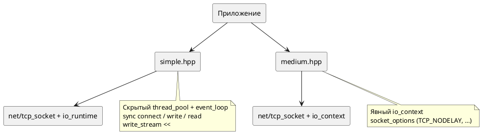

# Simple и Medium API

Уровни поверх full `net` — меньше boilerplate, те же async-примитивы внутри.



## Simple (`#include <netlib/simple.hpp>`)

Namespace: `rrmode::netlib::net::simple`.

| Компонент | Файл | Назначение |
|-----------|------|------------|
| `io_runtime` | `simple/io_runtime.hpp` | Пул + loop + `run_once` в фоне |
| `tcp_connection` | `simple/tcp_connection.hpp` | Подключение, `write`, `read`, `async_*` |
| `write_stream` | `simple/write_stream.hpp` | Буфер + `operator<<`, flush в destructor |
| `coro.hpp` | `simple/coro.hpp` | Тонкие coro-обёртки |

**Когда:** прототип, утилиты, мало кода.

```cpp
#include <netlib/simple.hpp>

rrmode::netlib::net::simple::io_runtime runtime;
auto conn = runtime.connect({"127.0.0.1", 9001});
conn.write("hello");
```

## Medium (`#include <netlib/medium.hpp>`)

Namespace: `rrmode::netlib::net::medium`.

| Компонент | Файл | Назначение |
|-----------|------|------------|
| `io_context` | `medium/io_context.hpp` | Настройка reactor/потоков |
| `socket_options` | `medium/socket_options.hpp` | TCP_NODELAY, буферы, keepalive, linger |
| `tcp_socket` / `tcp_acceptor` | `medium/*.hpp` | Обёртки над full с `apply_socket_options` |

**Когда:** нужны опции сокета без прямого `setsockopt` в приложении.

Пример: `examples/tcp_echo/medium_server.cpp`.

## Modules (опционально)

`NETLIB_BUILD_MODULES=ON`:

```cpp
import netlib.net.simple;
import netlib.net.medium;
import netlib.net;  // full
```

Зеркало umbrella-заголовков; источник правды — headers в `include/netlib/`.

## Сравнение с full + coro

| Критерий | Simple | Medium | Full + coro |
|----------|--------|--------|-------------|
| Контроль fd/loop | низкий | средний | полный |
| Callback chains | скрыты | частично | явно |
| Coroutines | optional `simple/coro` | через full | `net/coro.hpp` |
| UDP | нет | нет | `udp_socket` |
| Тесты на фейках | через full | через full | да |

## Связанные документы

- [API_LAYERS.md](API_LAYERS.md)
- [ARCHITECTURE.md](ARCHITECTURE.md)
- [EXAMPLES.md](EXAMPLES.md)
